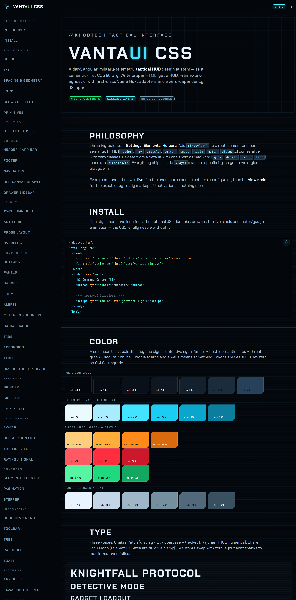

# VantaUI CSS

> A dark, angular, military-telemetry **tactical HUD** design system as a reusable CSS library. Semantic-first like [BeerCSS](https://www.beercss.com): write proper HTML, get a tactical UI. Reach for one short helper word only to deviate. Responsive by default, OKLCH, zero-dependency, framework-agnostic.



The vibe: cold near-black surfaces, sharp **chamfered** corners, a single **electric cyan** signal color that glows, uppercase machine-cut type, telemetry everywhere. Color is rare and always means something.

---

## Three ingredients

VantaUI is built the BeerCSS way — **Settings · Elements · Helpers** — not BEM, not utility-first:

- **Settings** — design tokens (colors, type, spacing, effects) as CSS custom properties. Override any of them, anywhere.
- **Elements** — semantic HTML styled directly. A `<header>` with a `<nav>` is an app bar; an `<article>` is a panel; a `<dialog class="left">` is a drawer; any `.vui` element holding a `<main>` is the whole app frame. **No component classes.**
- **Helpers** — one short word to change a default: `glow`, `danger`, `small`, `left`, `status`. Usually one is enough.

---

## Install

**GitHub (current distribution — not yet on npm or any CDN):**

```bash
npm i github:Khoding/vantaui-css#v1.5.0
```

In `package.json` this appears as:

```json
"vantaui-css": "github:Khoding/vantaui-css#v1.5.0"
```

```js
import 'vantaui-css'; // the stylesheet
import {init} from 'vantaui-css/js'; // optional behaviours (tabs, animated meters, clock)
init();
```

Fonts (Chakra Petch · Rajdhani · Share Tech Mono · Material Symbols) load automatically via `@import` inside the stylesheet — no extra step. If your build tool (e.g. LightningCSS) chokes on the remote `@import`, vendor a copy with that line stripped and load the fonts separately.

---

## The big idea

Add **`class="vui"`** to a root element (usually `<body>`). Inside it, plain semantic HTML is styled for you — **no classes required**:

```html
<body class="vui">
  <header>
    <a href="/">VANTA<b>UI</b></a>
    <nav><a aria-current="page">Overview</a><a>Units</a></nav>
    <menu>
      <button><i>settings</i></button>
    </menu>
  </header>

  <main>
    <h1>Command Center</h1>
    <article>
      <header><small class="vui-eyebrow">Diagnostics</small></header>
      <p>A chamfered panel. The header drew its own divider.</p>
      <footer><button type="submit">Authorize</button></footer>
    </article>

    <button>Override</button>
    <!-- outline -->
    <button class="danger">Abort</button>
    <!-- one helper word -->

    <label><input type="checkbox" role="switch" checked /> Active camo</label>
    <meter min="0" max="100" low="30" high="70" optimum="100" value="86"></meter>
  </main>
</body>
```

- **Semantic styles are scoped to `.vui`** and authored at zero specificity (`:where()`), so your app's own classes always win.
- **`<i>name</i>` is an icon** (Material Symbols ligature). Use `<em>` for italic text.
- Modern CSS does the smart bits: **`:has()`** detects icon-only buttons, panel headers, and the app frame; **container queries** collapse the header when it's narrow; **cascade layers** keep your styles on top; **`:checked` / `appearance`** draw the form controls.

> Prefer not to restyle bare elements? Skip the `.vui` root and nothing global changes except the design tokens.

---

## What you get from bare HTML

| Write this | You get |
| --- | --- |
| `<h1>`…`<h6>` | Uppercase, tracked display headings |
| `<button>` | Chamfered outline button (`type="submit"` → filled primary) |
| `<button><i>close</i></button>` | Square icon button (detected via `:has`) |
| `<i>home</i>` | The home glyph (Material Symbols) |
| `<a>` `<code>` `<kbd>` `<mark>` `<pre>` `<blockquote>` `<hr>` | Tactical inline + block styles |
| `<article>` | Chamfered panel; `<header>`/`<footer>` auto-divide |
| `<input>` `<textarea>` `<select>` | Inset terminal fields with focus glow |
| `<input type="checkbox \| radio">` | Notched / round emissive marks |
| `<input type="checkbox" role="switch">` | Angular toggle switch |
| `<input type="range">` | Tactical slider |
| `<meter>` `<progress>` | Telemetry bars (`<meter>` colors by threshold) |
| `<table>` | Mono data grid, eyebrow headers, cyan row hover |
| `<details><summary>` | Zero-JS chamfered disclosure |
| `<dialog>` | Chamfered modal with scrim backdrop |
| `<header>` _(with a `<nav>`)_ | App bar; collapses to a burger when narrow |
| `<footer>` | Footer bar (`status` / `columns` shapes) |
| `<nav><ol>…</ol></nav>` | Breadcrumb (detected, zero classes) |
| `.vui` element holding a `<main>` | Full app frame (header / rail / stage / footer by element) |
| `[role="status"]` / `[role="alert"]` | Info / threat alert with accent rail + glyph |
| `[role="tablist"]` / `[role="tab"]` | Tab strip (state via the JS helper or your framework) |

---

## Helpers (deviate with one word)

Helpers are short, element-scoped, and authored at zero specificity, so your own classes still win.

- **Buttons** — `fill` `ghost` · tones `amber` `danger` `secure` · sizes `small` `large` · `block` · `icon`. Style a non-button as one with `.button`.
- **Panels** (`<article>`) — `raised` `inset` `flat` `glow` `notch` `brackets`.
- **Badges** — `.badge` + `cyan` `amber` `red` `green` `neutral` · `solid` · `dot`.
- **Alerts** — re-tone `[role=status]`/`[role=alert]` with `warn` `secure` `info`.
- **Meters / gauges** — `.meter` / `.gauge` + `cyan` `amber` `red` `green` · `small` `large` · `segmented`.
- **Header** — `glow` `center` `float` `bare` `tall` `sticky`. An `<hr>` is a vertical divider; a `<menu>` is the trailing actions cluster.
- **Footer** — `status` (telemetry strip) · `columns` (sitemap); `signal` on a status cell.
- **Navigation** — `<nav class="left">` side rail · `<nav class="bottom">` phone command bar · `<dialog class="left|right">` off-canvas drawer.
- **Alignment** — `max` (flex spacer) · `right` / `left` · `active` (alias of `aria-current="page"`).

State is semantic first: mark the current item with `aria-current="page"`, an invalid field with `aria-invalid`, a switch with `role="switch"`.

---

## App frame

Any `.vui` element that directly holds a `<main>` becomes an app frame and places its landmarks **by element** — no wrapper classes:

```html
<body class="vui">
  <nav class="left">…</nav>
  <!-- side rail: vertical ≥768px, bottom bar below -->
  <header>…</header>
  <!-- top bar -->
  <main>…</main>
  <!-- scrolling stage -->
  <footer>…</footer>
  <!-- bottom bar (or <nav class="bottom">) -->
</body>
```

On `<body>` it fills the viewport; nested in a sized box it fills the box. Drop the `<nav class="left">` for a stacked (header / main / footer) shell.

---

## Layout & responsive

Mobile-first breakpoints: **s** 36rem · **m** 48rem · **l** 64rem · **xl** 80rem. These layout/utility helpers keep the `vui-` prefix (they're free-floating, so the prefix keeps them collision-safe):

```html
<!-- 12-col grid: stacks on phones, columns from each breakpoint up -->
<div class="vui-grid">
  <article class="vui-s12 vui-m6 vui-l4">…</article>
  <article class="vui-s12 vui-m6 vui-l8">…</article>
</div>

<!-- zero-config auto grid (set the min track) -->
<div class="vui-autogrid" style="--vui-min: 16rem">… cards …</div>

<!-- container, flex helpers, show/hide -->
<div class="vui-container">…</div>
<div class="vui-cluster">…</div>
<aside class="vui-until-m">phones only</aside>
<aside class="vui-from-m">tablet and up</aside>
```

Plus utilities: `vui-flex/grid-d`, `vui-gap-0…8`, `vui-p-/pi-/pb-`, `vui-m-/mb-/mbe-`, `vui-text-*`, `vui-font-*`, `vui-text-{cyan…}`, `vui-bg-*`, `vui-glow-*`, and the HUD primitives `vui-eyebrow`, `vui-readout`, `vui-dot`, `vui-chamfer`, `vui-notch`, `vui-brackets`. Typography is fluid (`clamp()`); nothing is tied to a breakpoint.

---

## Vue 3

```js
import {createApp} from 'vue';
import VantaUI from 'vantaui-css/vue'; // imports the CSS, adds `.vui` to <body>, boots behaviours
import App from './App.vue';

createApp(App).use(VantaUI).mount('#app');
// options: app.use(VantaUI, { behaviours: false, bodyClass: false, root: el })
```

## Nuxt 3

```ts
// nuxt.config.ts
export default defineNuxtConfig({
  modules: ['vantaui-css/nuxt'],
  VantaUI: {behaviours: true, bodyClass: true}, // all default true
});
```

The module registers the stylesheet, adds `.vui` to `<body>` app-wide, and (client-side) boots the optional behaviours (tabs, animated meters, live clock).

---

## Theming

Everything is CSS custom properties — override them anywhere (they cascade):

```css
:root {
  --accent: oklch(84.6% 0.133 212.1); /* the signal color */
  --bevel-md: 14px; /* deeper chamfers */
  --container-max: 90rem;
}
```

Colors are **OKLCH** (the `dist` build targets engines that support it; the `src/` tokens keep hex fallbacks for older targets if you build your own).

---

## Develop

```bash
npm run build     # bundle src/ → dist/vantaui.css + dist/vantaui.min.css (LightningCSS)
npm run palette   # regenerate the OKLCH palette from the source hex values
```

Source lives in `src/` (tokens → reset → base → layout → components → utilities), wired into cascade layers by `src/vantaui.css`. Open `docs/index.html` for the full gallery.

## Browser support

Targets evergreen browsers from ~2023: requires `:has()`, cascade layers, container queries, `color-mix()`, `oklch()`, `mask`, and `conic-gradient` — Chrome/Edge 111+, Firefox 121+, Safari 16.4+.

## License

MIT. An original interpretation of a tactical-HUD look — no trademarked marks or character likenesses. For fan / personal projects.
